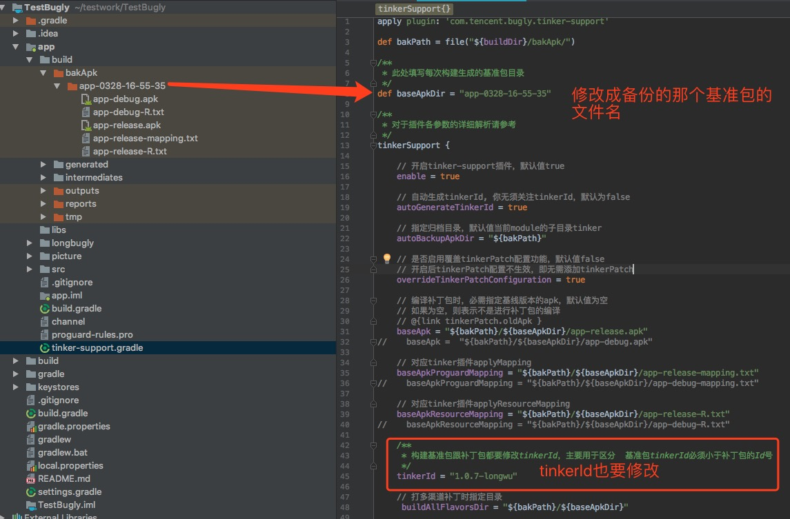

```
<p style="color: #AD5D0F;font-size: 13px; font-family: '宋体';">这块踩了好的坑,贴出来,做个记录,方便自己也方便他人</p>
```
> # 一. 集成bugly和walle
 >> ####  *[bugly集成方法](https://bugly.qq.com/docs/user-guide/instruction-manual-android-hotfix/?v=20180119105842)*
>>  ####  walle集成方式这说一下,避免这里出错

>>> 1. 在项目的根目录 build.gradle的dependencies{ }添加  classpath 'com.meituan.android.walle:plugin:1.1.6'
>>> 2. 在app下的build.gradle中的顶部添加 apply plugin: 'walle'
```
walle {
       apkOutputFolder = new File("${project.buildDir}/outputs/channels")
       apkFileNameFormat = '${appName}-${packageName}-${channel}-${buildType}-v${versionName}-${versionCode}-${buildTime}-${flavorName}.apk'
       //configFile与channelFile两者必须存在一个，否则无法生成渠道包。两者都存在时优先执行configFile
       channelFile = new File("${project.getProjectDir()}/channel")
      //configFile = new File("${project.getProjectDir()}/config.json")
}

```
<p style="color: #ff0000;font-size: 15px; font-family: '宋体';">(ps : walle{ }这个代码块上下位置都可以,我放在了最底部 ,还是不清可以下载demo查看)</p>

>>>  3. 拷贝channel文件到 主app/的目录下


> # 二. 打渠道包和补丁包

>> ## 集成好以后的操作步奏

>> ### 一: 打渠道包,因为需要走编译流程,也会随之生成相应的基础包

>>> 1. 使用命令行 gradlew clean assembleReleaseChannels , 此时会在app/build/barapk 目录下生成基准包(整个文件一定要备份保存):如 **app-0328-16-55-35**文件夹;
>>> 2. 此时再查看 app/build/outputs/channels目录下生成所有渠道包. 如图1 

>> ### 二: 打补丁包.一个补丁适配所有渠道


>>> 1. 把之前备份的R,mapping,apk的app-0328-16-55-35文件夹文件复制到build/barapk目录下,也就是在此基准包基础上的补丁
>>> 2. 修改tinker-support.gradlew文件,def baseApkDir = "" 赋值为 ***def baseApkDir = "app-0328-16-55-35"***
>>> 3. 构建基准包跟补丁包都要修改tinkerId，主要用于区分  基准包tinkerId必须小于补丁包的Id号
        ***tinkerId = "1.0.6-longwu"***  //其中tinkerId命名一般是跟随versionname或者git提交编号; 如图2:
>>> 4. 点击android studio右侧 Gradle 选择tasks/tinker-support下的buildTinkerPatchRelease,会在 app/build/outputs/patch下 选择patch_signed_7zip.apk这个是最终补丁包,
然后上传腾讯bugly后台即可,如图3 

